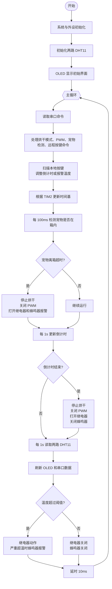

# STM32 主程序流程图

流程图依据 `USER/main.c` 生成，覆盖系统初始化、DHT11 初始化、串口/按键控制、定时任务、宠物离箱检测、温控报警和 OLED 刷新逻辑。

```mermaid
flowchart TD
    A([开始]) --> B[系统初始化 SystemInit]
    B --> C[延时、LED、串口、OLED、蜂鸣器、PWM、继电器、按键、宠物检测引脚、TIM2 初始化]
    C --> D[串口打印 Start]
    D --> E{DHT11_1 初始化成功?}
    E -- 否 --> E1[打印 DHT11_1 Error\n延时 1s] --> E
    E -- 是 --> F[打印 DHT11_1 OK]
    F --> G{DHT11_2 初始化成功?}
    G -- 否 --> G1[打印 DHT11_2 Error\n延时 1s] --> G
    G -- 是 --> H[打印 DHT11_2 OK\n打印串口命令说明]
    H --> I[OLED 显示固定标签\n温度、倒计时、报警温度、继电器状态]
    I --> J{{进入 while(1) 主循环}}

    J --> K[读取串口命令 USART1_GetCommand]
    K --> L{是否为宠物烘干模式命令?}
    L -- 是 --> L1[按狗/猫和体型设置\n倒计时、报警温度、PWM 占空比\nrunning=1\n清除离箱报警状态]
    L -- 否 --> M{是否为设置 PWM 命令?}
    M -- 是 --> M1[限制占空比 0~100\n运行中立即设置 PWM\n未运行则保存占空比]
    M -- 否 --> N{是否为宠物检测开关命令?}
    N -- 开启 --> N1[pet_monitor_enabled=1\n清零离箱计时和报警标志]
    N -- 关闭 --> N2[pet_monitor_enabled=0\n清零离箱计时和报警标志]
    N -- 否 --> O{是否为串口按键命令?}
    O -- 是 --> O1[转换为按键动作\n调整倒计时或报警温度]
    O -- 否 --> P[无串口动作]

    L1 --> Q[扫描实体按键 Key_Scan]
    M1 --> Q
    N1 --> Q
    N2 --> Q
    O1 --> Q
    P --> Q
    Q --> R{有按键按下?}
    R -- 是 --> R1[KEY_UP: 倒计时 +60s\nKEY_DOWN: 倒计时 -60s\nTEMP_UP: 报警温度 +1\nTEMP_DOWN: 报警温度 -1]
    R -- 否 --> S[读取 TIM2 计数值\n计算经过的 100us tick]
    R1 --> S

    S --> T{累计 tick >= 1ms?}
    T -- 是 --> U[更新时间片计数\nDHT11 计时、宠物采样计时、倒计时计时]
    U --> V{DHT11 计时 >= 1000ms?}
    V -- 是 --> V1[置位 dht_read_flag]
    V -- 否 --> W{宠物采样计时 >= 100ms?}
    V1 --> W

    W -- 是 --> W1[读取宠物存在状态]
    W1 --> X{宠物检测开启且正在运行?}
    X -- 是 --> Y{检测到宠物存在?}
    Y -- 是 --> Y1[清零离箱计时]
    Y -- 否 --> Y2[离箱计时 +100ms]
    Y2 --> Z{离箱 >= 5000ms 且未报警?}
    Z -- 是 --> Z1[running=0\nPWM=0\n继电器打开\n蜂鸣器打开\n打印离箱报警]
    Z -- 否 --> AA[继续]
    X -- 否 --> X1[清零离箱计时]
    W -- 否 --> AB{running=1?}
    Y1 --> AB
    Z1 --> AB
    AA --> AB
    X1 --> AB

    AB -- 是 --> AC[倒计时计时 +1ms]
    AC --> AD{倒计时计时 >= 1000ms?}
    AD -- 是 --> AD1[倒计时减 1s]
    AD1 --> AE{倒计时为 0?}
    AE -- 是 --> AE1[running=0\nPWM=0\n继电器打开\n蜂鸣器关闭\n打印时间到]
    AE -- 否 --> AF[继续]
    AD -- 否 --> AF
    AB -- 否 --> AF
    AF --> T
    T -- 否 --> AG{dht_read_flag=1?}
    AE1 --> T

    AG -- 是 --> AH[读取 DHT11_1 和 DHT11_2 温湿度]
    AH --> AI[打印温度、倒计时、报警温度、PWM\nLED 翻转\nOLED 刷新两路温度]
    AI --> AJ{running=1?}
    AJ -- 是 --> AK{任一路温度 > 报警温度 + 5?}
    AK -- 是 --> AK1[蜂鸣器打开]
    AK -- 否 --> AK2[蜂鸣器关闭]
    AK1 --> AL{任一路温度 > 报警温度?}
    AK2 --> AL
    AL -- 是 --> AL1[继电器打开]
    AL -- 否 --> AL2[继电器关闭]
    AJ -- 否 --> AM[跳过温控输出]
    AG -- 否 --> AN[刷新 OLED 倒计时、报警温度、继电器状态]
    AL1 --> AN
    AL2 --> AN
    AM --> AN
    AN --> AO[延时 10ms]
    AO --> J
```

## 简化版流程图

如果论文中不需要展示每个分支，可以使用下面的简化版。


